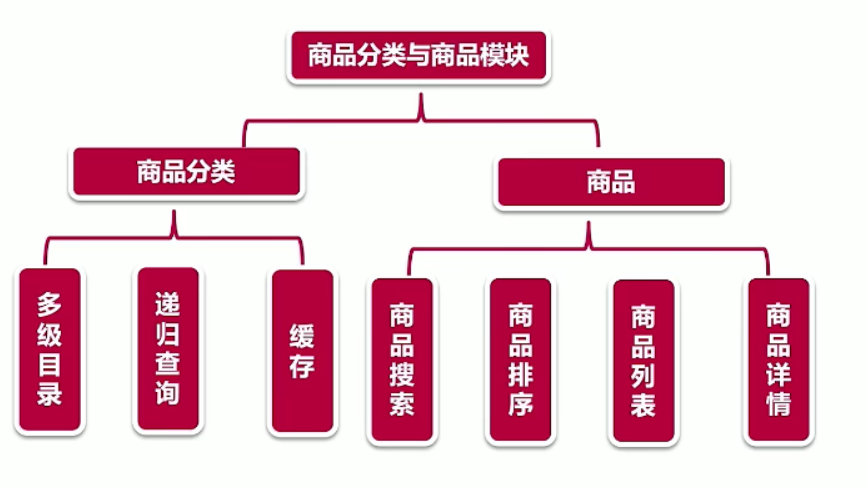
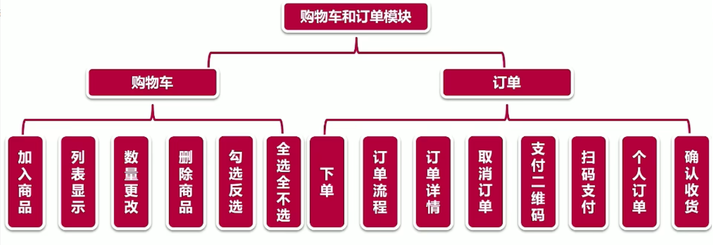
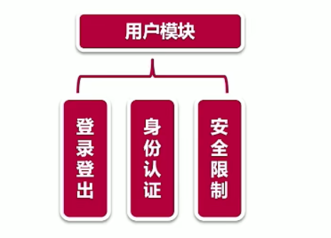
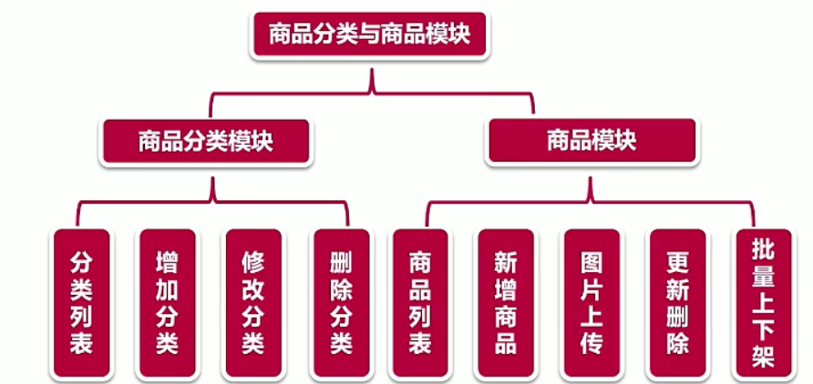
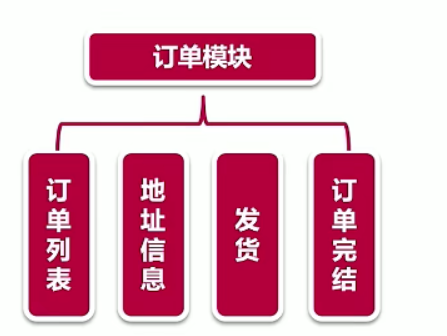
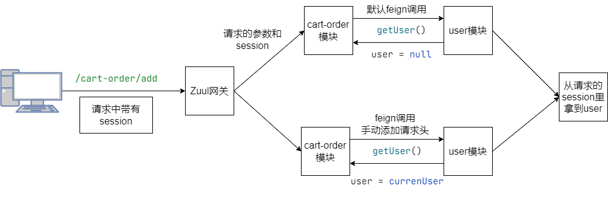

#### 模块拆分

- Eureka-serve模块
- 网关模块
- 公共模块
- 用户模块
- **商品分类模块和商品模块**
- **购物车和订单模块**

**功能介绍前台：**











#### 整合Eureka server

引入依赖：`spring-cloud-starter-netflix-eureka-server`

配置文件指定服务端口：

```properties
spring.application.name=eureka-server
server.port=8000
eureka.instance.hostname=localhost
# 不用拿到注册的服务列表
eureka.client.fetch-registry=false
# 自己就是服务中心
eureka.client.register-with-eureka=false
eureka.client.service-url.defaultZone=http://${eureka.instance.hostname}:${server.port}/eureka/
```

启动类加上`@EnableEurekaServer`来提供服务的注册与发现。

#### 整合公用的工具类（common包下的类）

由于该服务只是提供工具类，例如异常响应，错误枚举类，常量类，全局异常处理（`@ControllerAdvice`)。因此不用加上eureka client依赖，也不用提供http请求接口。

#### 整合用户模块

相比原来的pom文件多了一个`spring-cloud-starter-netflix-eureka-client`，因为要提供服务。依赖文件：

```xml
<dependencies>
    <dependency>
      <groupId>org.springframework.boot</groupId>
      <artifactId>spring-boot-starter-web</artifactId>
    </dependency>
    <dependency>
      <groupId>mysql</groupId>
      <artifactId>mysql-connector-java</artifactId>
    </dependency>
    <dependency>
      <groupId>org.mybatis.spring.boot</groupId>
      <artifactId>mybatis-spring-boot-starter</artifactId>
      <version>2.1.1</version>
    </dependency>
    <dependency>
      <groupId>org.springframework.cloud</groupId>
      <artifactId>spring-cloud-starter-netflix-eureka-client</artifactId>
    </dependency>
    <dependency>
      <groupId>org.springframework.boot</groupId>
      <artifactId>spring-boot-starter-data-redis</artifactId>
    </dependency>
    <!-- 使用redis存session session共享-->
    <dependency>
      <groupId>org.springframework.session</groupId>
      <artifactId>spring-session-data-redis</artifactId>
    </dependency>
    <dependency>
      <groupId>org.springframework.cloud</groupId>
      <artifactId>spring-cloud-starter-openfeign</artifactId>
    </dependency>
    <dependency>
      <groupId>com.imooc</groupId>
      <artifactId>cloud-mall-common</artifactId>
      <version>1.0-SNAPSHOT</version>
      <scope>compile</scope>
    </dependency>
  </dependencies>
```

启动类开启swagger和redis缓存：

```java
@SpringBootApplication
@EnableSwagger2
@MapperScan(basePackages = "com.imooc.cloud.mall.practice.user.model.dao")
@EnableRedisHttpSession
public class UserApplication {

    public static void main(String[] args) {
        SpringApplication.run(UserApplication.class, args);
    }
}
```

#### 整合zuul网关模块（请求鉴权和路由）

因为zuul网关模块也是提供服务的，需要把自己注册到eureka服务中心上去，因此需要引入eureka client模块。依赖文件：

```java
<dependencies>
    <dependency>
      <groupId>org.springframework.cloud</groupId>
      <artifactId>spring-cloud-starter-netflix-eureka-client</artifactId>
    </dependency>
    <dependency>
      <groupId>org.springframework.cloud</groupId>
      <artifactId>spring-cloud-starter-netflix-zuul</artifactId>
    </dependency>
    <dependency>
      <groupId>com.imooc</groupId>
      <artifactId>cloud-mall-user</artifactId>
      <version>1.0-SNAPSHOT</version>
      <scope>compile</scope>
    </dependency>
  </dependencies>
```

这里依赖user模块，是因为使用zuul来对用户请求的地址进行权限校验，如`/admin/**（校验是否是管理员）`，`/cart/**和/order/**（来校验是否登录和登录的用户是否与购物车的用户id一致）`。

Zuul网关的配置文件

```properties
# 因为网关模块依赖user模块，需要引入数据库连接信息 引入了User实体类
spring.datasource.name=imooc_mall_datasource
spring.datasource.url=jdbc:mysql://127.0.0.1:3307/imooc_mail?useUnicode=true&characterEncoding=utf8&autoReconnect=true&useSSL=false&serverTimezone=UTC
spring.datasource.driver-class-name=com.mysql.cj.jdbc.Driver
spring.datasource.username=root
spring.datasource.password=19980805xxl

# zuul网关代理地址：代理了所有的模块，请求直接打到8083即可，通过zuul实现路由。
server.port=8083
zuul.host.connect-timeout-millis=15000
zuul.prefix=/
zuul.routes.cloud-mall-user.path=/user/**
zuul.routes.cloud-mall-user.service-id=cloud-mall-user
zuul.routes.cloud-mall-category-product.path=/category-product/**
zuul.routes.cloud-mall-category-product.service-id=cloud-mall-category-product
zuul.routes.cloud-mall-cart-order.path=/cart-order/**
zuul.routes.cloud-mall-cart-order.service-id=cloud-mall-cart-order
```

使用feign来调用用户模块提供的校验是否是当前用户是否是管理员的服务:

```java
// 使用@FeignClient + value指定提供服务的模块名称 fallback指定hystrix熔断处理类
@FeignClient(value = "cloud-mall-user")
public interface UserFeignClient {

    @PostMapping("/checkAdminRole")
    public Boolean checkAdminRole(@RequestBody User user);
}
```

用户鉴权器（过滤器类需要继承ZuulFilte）：

```java
@Component
public class UserFilter extends ZuulFilter {

    @Override
    public String filterType() {
        // 请求前过滤器
        return FilterConstants.PRE_TYPE;
    }

    @Override
    public int filterOrder() {
        // 过滤器顺序
        return 0;
    }

    @Override
    public boolean shouldFilter() {
        // 拿到上下文
        RequestContext ctx = RequestContext.getCurrentContext();
        // 上下文拿到请求
        HttpServletRequest request = ctx.getRequest();
        // 拿到求的URI
        String requestURI = request.getRequestURI();
        // 通过网址来判断用户是否需要鉴权 - false不需要 true需要
        if (requestURI.contains("images") || requestURI.contains("pay")) {
            return false; 
        }
        if (requestURI.contains("cart") || requestURI.contains("order")) {
            return true;
        }
        return false;
    }

    @Override
    // 实际的过滤器处理接口
    public Object run() throws ZuulException {
        RequestContext currentContext = RequestContext.getCurrentContext();
        HttpServletRequest request = currentContext.getRequest();
        // 从请求中拿到session
        HttpSession session = request.getSession();
        // session中查询是否有登录用户
        User currentUser = (User)session.getAttribute(Constant.IMOOC_MALL_USER);
        if (currentUser == null) {
            // 拦截请求，网关不进行转发
            currentContext.setSendZuulResponse(false);
            currentContext.setResponseBody("{\n"
                    + "    \"status\": 10007,\n"
                    + "    \"msg\": \"NEED_LOGIN\",\n"
                    + "    \"data\": null\n"
                    + "}");
            // 返回状态码
            currentContext.setResponseStatusCode(200);
        }
        return null;
    }
}
```

管理员鉴权器：

```java
@Component
public class AdminFilter extends ZuulFilter {

    @Autowired
    UserFeignClient userFeignClient;


    @Override
    public String filterType() {
        // 请求前过滤器
        return FilterConstants.PRE_TYPE;
    }

    @Override
    public int filterOrder() {
        return 0;
    }

    @Override
    public boolean shouldFilter() {
        RequestContext ctx = RequestContext.getCurrentContext();
        HttpServletRequest request = ctx.getRequest();
        String requestURI = request.getRequestURI();
        // 校验请求URI
        if (requestURI.contains("adminLogin")) {
            return false;
        }
        if (requestURI.contains("admin")) {
            return true;
        }
        return false;
    }

    @Override
    public Object run() throws ZuulException {
        RequestContext currentContext = RequestContext.getCurrentContext();
        HttpServletRequest request = currentContext.getRequest();
        HttpSession session = request.getSession();
        User currentUser = (User)session.getAttribute(Constant.IMOOC_MALL_USER);
        if (currentUser == null) {
            // 不进行路由转发
            currentContext.setSendZuulResponse(false);
            // 直接通过zuul返回请求，设置响应体
            currentContext.setResponseBody("{\n"
                    + "    \"status\": 10010,\n"
                    + "    \"msg\": \"NEED_LOGIN\",\n"
                    + "    \"data\": null\n"
                    + "}");
            currentContext.setResponseStatusCode(200);
            return null;
        }

        //校验是否是管理员
        Boolean adminRole = userFeignClient.checkAdminRole(currentUser);
        if (!adminRole) {
            currentContext.setSendZuulResponse(false);
            currentContext.setResponseBody("{\n"
                    + "    \"status\": 10011,\n"
                    + "    \"msg\": \"NEED_ADMIN\",\n"
                    + "    \"data\": null\n"
                    + "}");
            currentContext.setResponseStatusCode(200);
        }
        return null;
    }
}
```

**最后一步别忘了在启动类加上注解**：

```java
@EnableZuulProxy // 开启网关路由
@EnableFeignClients // 开启feign处理http请求
@SpringCloudApplication 
@EnableRedisHttpSession // 开启session共享机制
public class ZuulGatewayApplication {
    public static void main(String[] args) {
        SpringApplication.run(ZuulGatewayApplication.class, args);
    }
}
```

```java
@Target({ElementType.TYPE})
@Retention(RetentionPolicy.RUNTIME)
@Documented
@Inherited
@SpringBootApplication
@EnableDiscoveryClient // 发现服务
@EnableCircuitBreaker // 开启断路器
public @interface SpringCloudApplication {
}
```

#### Session共享机制

在多模块项目中需要实现session的共享。

- 登录状态的保持，之前在单体项目中，将用户信息存到session中，之后的访问，会先从session中拿到用户信息，然后再执行业务逻辑。
- 在多模块项目中，session会被网关过滤掉，因此需要实现session的共享。

实现逻辑，引入Redis作为session的中介，通过项目连接到的redis作为储存空间，把session写到redis里面，因为所有的模块都是连接到一个redis里面的，别的模块如果要取session的话，直接从redis里取。

具体在项目中的实现过程：保存和读取。

用户模块之前引入了`spring-session-data-redis`这个依赖，在配置类里配置redis：

```properties
spring.session.store-type=redis
spring.redis.host=localhost
spring.redis.port=6379
spring.redis.password=
```

配置zuul模块，不对session进行过滤：

```properties
spring.session.store-type=redis
spring.redis.host=localhost
spring.redis.port=6379
spring.redis.password=
# 不过滤session
zuul.sensitive-headers=
zuul.host.connect-timeout-millis=15000
```

**最重要一步在相关的启动类上加`@EnableRedisHttpSession`**。

#### 整合目录和订单模块（cloud-mall-category-product）

首先还是引入eureka-client，spring-session-data-redis依赖和openfeign：

```xml
    <dependency>
      <groupId>org.springframework.cloud</groupId>
      <artifactId>spring-cloud-starter-netflix-eureka-client</artifactId>
    </dependency>
    <dependency>
      <groupId>org.springframework.boot</groupId>
      <artifactId>spring-boot-starter-data-redis</artifactId>
    </dependency>
    <dependency>
      <groupId>org.springframework.session</groupId>
      <artifactId>spring-session-data-redis</artifactId>
    </dependency>
    <dependency>
      <groupId>org.springframework.cloud</groupId>
      <artifactId>spring-cloud-starter-openfeign</artifactId>
    </dependency>
```

配置session共享：

```properties
spring.session.store-type=redis
spring.redis.host=localhost
spring.redis.port=6379
spring.redis.password=
```

这个模块相对独立，没有使用Feign调用其他模块的接口。只是给其他模块来提供访问的接口（为其他模块来提供服务）。

#### 最后一个模块cart-order模块的整合

```xml
<dependency>
      <groupId>org.springframework.cloud</groupId>
      <artifactId>spring-cloud-starter-netflix-eureka-client</artifactId>
    </dependency>
    <dependency>
      <groupId>org.springframework.boot</groupId>
      <artifactId>spring-boot-starter-data-redis</artifactId>
    </dependency>
    <dependency>
      <groupId>org.springframework.session</groupId>
      <artifactId>spring-session-data-redis</artifactId>
    </dependency>
    <dependency>
      <groupId>org.springframework.cloud</groupId>
      <artifactId>spring-cloud-starter-openfeign</artifactId>
    </dependency>
        <dependency>
      <groupId>com.imooc</groupId>
      <artifactId>cloud-mall-category-product</artifactId>
      <version>1.0-SNAPSHOT</version>
      <scope>compile</scope>
    </dependency>
```

降低耦合，首先分析cart-order模块用到了哪些category和product模块的功能：

```java
// 使用了productMapper.selectByPrimarykey 
// 因此在category和product模块的控制类下新增接口，提供上面的服务调用：
// 修改category和product模块
    @GetMapping("product/detailForFeign")
    public Product detailForFeign(@RequestParam Integer id) {
        Product product = productService.detail(id);
        return product;
    }
```

在cart-order模块新建fegin包和ProductFeignClient接口，而不是引用其他类的mapper。

````java
/**
 * 描述：     商品FeignClient
 */
@FeignClient(value = "cloud-mall-category-product")
public interface ProductFeignClient {

    // feign的调用是内部调用，不经过网关的，直接去请求到eureka server，拿到请求地址去访问，
    // 因此地址不能加上带有网关的前缀（/category-product/**）
    // 直接与category-product模块的接口一致即可
    @GetMapping("product/detailForFeign")
    Product detailForFeign(@RequestParam Integer id);

    @PostMapping("product/updateStock")
    void updateStock(@RequestParam Integer productId, @RequestParam Integer stock);

}
````

在controller和接口实现类中使用ProductFeignClient替换productMapper即可。

购物车和订单模块用到了用户信息做校验，因此需要使用user模块的服务。为了避免暴露用户信息，需要在filter中对getUser进行拦截(Zuul里面)

```java
// 提供服务  
/**
     * 获取当前登录的User对象
     * @param session
     * @return
     */
    @GetMapping("/getUser")
    @ResponseBody
    public User getUser(HttpSession session) {
        User currentUser = (User) session.getAttribute(Constant.IMOOC_MALL_USER);
        return currentUser;
    }
```

```java
// 处理请求鉴权
    @Override
    public boolean shouldFilter() {
        RequestContext ctx = RequestContext.getCurrentContext();
        HttpServletRequest request = ctx.getRequest();
        String requestURI = request.getRequestURI();
        // 通过网址来判断用户是否需要鉴权
        if (requestURI.contains("images") || requestURI.contains("pay")) {
            return false;
        }
        if (requestURI.contains("cart") || requestURI.contains("order") || requestURI.contains("getUser")) {
            return true;
        }
        return false;
    }
```

在cart-order中新建UserFeign接口：

```java
/**
 * 描述：     UserFeign客户端
 */
@FeignClient(value = "cloud-mall-user")
public interface UserFeignClient {

    /**
     * 获取当前登录的User对象
     * @return
     */
    @GetMapping("/getUser")
    User getUser();
}
```

替换控制器类中使用userFilter中



由于cart-order模块与user模块之间的调用使用的是feign，feign的调用不经过网关，从网关传入的请求头信息（包含session）都不会通过feign进行转发，只是简单的调用提供的接口，因此调用user模块的getUser()服务时，会返回一个空的user对象，即用户未登录。

因此需要在cart-order模块编写过滤器类`FeignRequestInterceptor`实现`RequestInterceptor`，在进行feign调用时，把请求头的消息带上：

```java
/**
 * 描述：     Feign请求拦截器
 */
@EnableFeignClients
@Configuration
public class FeignRequestInterceptor implements RequestInterceptor {
    @Override
    public void apply(RequestTemplate requestTemplate) {
        //通过RequestContextHolder获取到请求
        RequestAttributes requestAttributes = RequestContextHolder.getRequestAttributes();
        if (requestAttributes == null) {
            return;
        }
        // 从请求的属性拿到请求的httpServletRequest请求
        HttpServletRequest request = ((ServletRequestAttributes) requestAttributes).getRequest();
        // 拿到请求头的names
        Enumeration<String> headerNames = request.getHeaderNames();
        if (headerNames != null) {
            while (headerNames.hasMoreElements()) {
                String name = headerNames.nextElement();
                // 拿到请求头的值
                Enumeration<String> values = request.getHeaders(name);
                while (values.hasMoreElements()) {
                    String value = values.nextElement();
                    // header的名和head的值
                    requestTemplate.header(name, value);
                }
            }
        }
    }
}
```